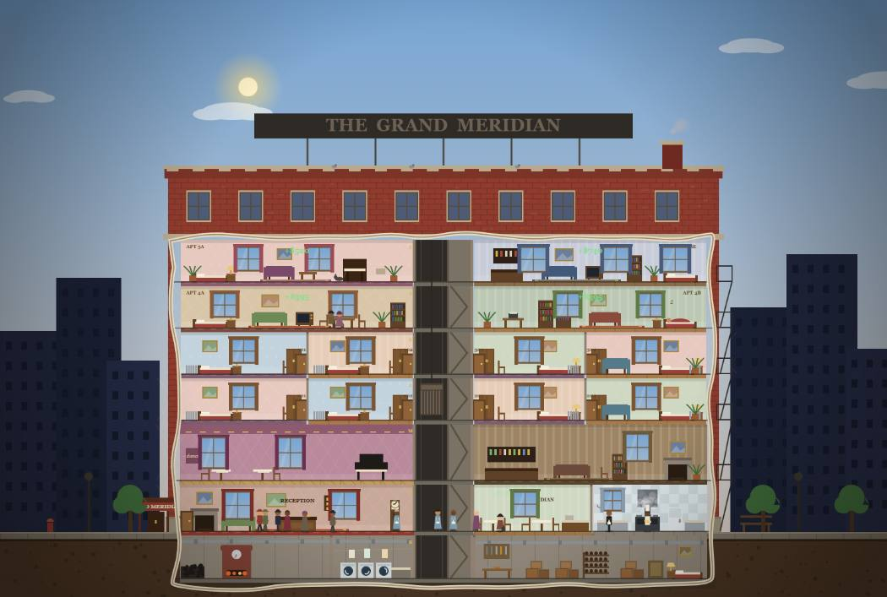
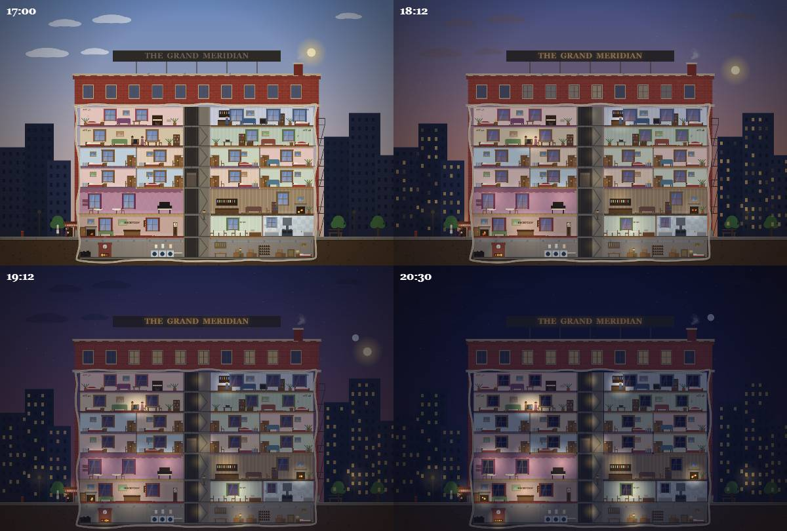
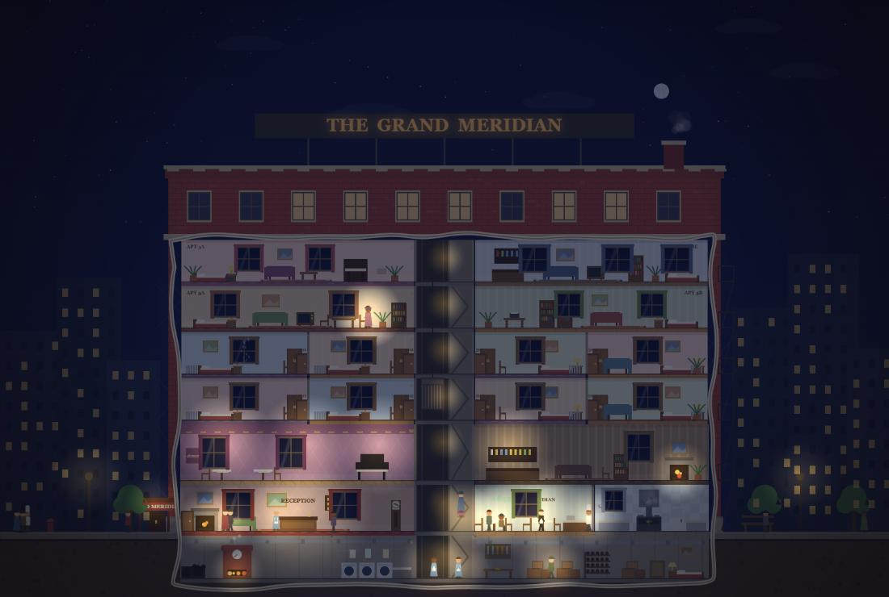

# The Grand Meridian

A living cutaway of a grand 1920s residential & tourist hotel, in a single HTML file.
Inspired by the classic mid-century "lost art of the cutaway" illustrations — torn plaster
rim, brick shell, and seven furnished floors of little people going about their day.

**[Play it here](https://deepspace000.github.io/The-Grand-Meridian/)** (GitHub Pages) — or just open `index.html` in a browser. No build, no dependencies.

## What's inside

- **Seven floors**: boiler room, laundry & janitor's den in the basement; lobby, café and
  kitchen; a ballroom with grand piano and a lounge bar; hotel rooms 201–304; rented
  apartments; and a penthouse. A lift travels the central shaft and people climb the stairs.
- **A full cast**: 13 named staff (manager, receptionist, night porter, chefs, waiters,
  chambermaids, janitor, pianist, doorman), 5 permanent tenants, arriving hotel guests,
  visitors calling for tea, and tradesmen — plumber, lift engineer, boiler man, electrician —
  who turn up when something breaks. Hover anyone for their name, role, and what they're doing.
- **A working economy**: room rates, weekly rents, café bills, staff wages, coal deliveries
  and repair invoices, all posted live to the hotel ledger in the corner register panel.
- **A gradual day/night cycle**: sun and moon arcs, smoothstep dusk from 16:30 to 20:30,
  city windows that light up one by one, a rooftop neon sign that hums on, fireplaces,
  flickering televisions, and sleepers who become little blanket lumps.

## Controls

- **❚❚ / ▶ / ▶▶ / ▶▶▶** — pause and three speeds (one day ≈ 6 minutes at ▶)
- **Hover** any person for a tooltip with their name, role, and current status
- The register panel sections (Staff, Tenants, Guests, Visitors, Tariff Card, Day Book) fold open and closed
